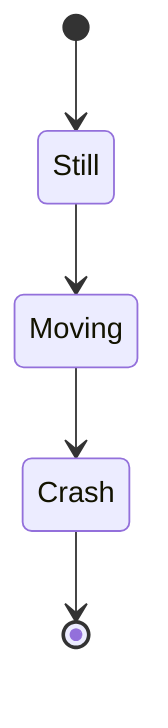
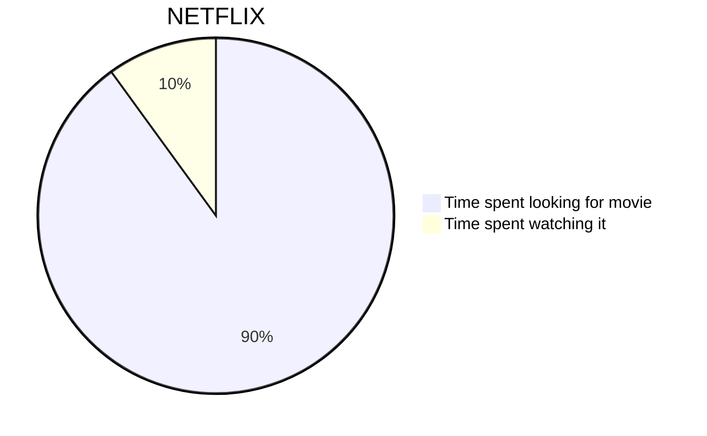

**# Tests, can be ignored

How to use:
remove the '.' before the name of the file. Preferably only use in `mkdocs serve`.

<!-- Could use some work on the themes, but it isn't an issue -->


<!-- Nice KaTeX works -->
$$
\cos x=\sum_{k=0}^{\infty}\frac{(-1)^k}{(2k)!}x^{2k}
$$



```canvasjs
{
  "height": 500,
  "title": {
    "text": "Custom Legend Chart"
  },
  "legend": {
    "itemclick": "toggleDataSeries"
  },
  "data": [
    {
      "type": "column",
      "name": "Apples",
      "showInLegend": true,
      "dataPoints": [
        { "label": "Jan", "y": 10 },
        { "label": "Feb", "y": 15 },
        { "label": "Mar", "y": 25 }
      ]
    },
    {
      "type": "column",
      "name": "Oranges",
      "showInLegend": true,
      "dataPoints": [
        { "label": "Jan", "y": 20 },
        { "label": "Feb", "y": 10 },
        { "label": "Mar", "y": 15 }
      ]
    }
  ]
}
```
