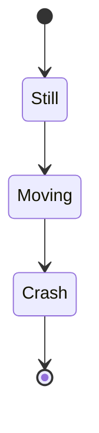
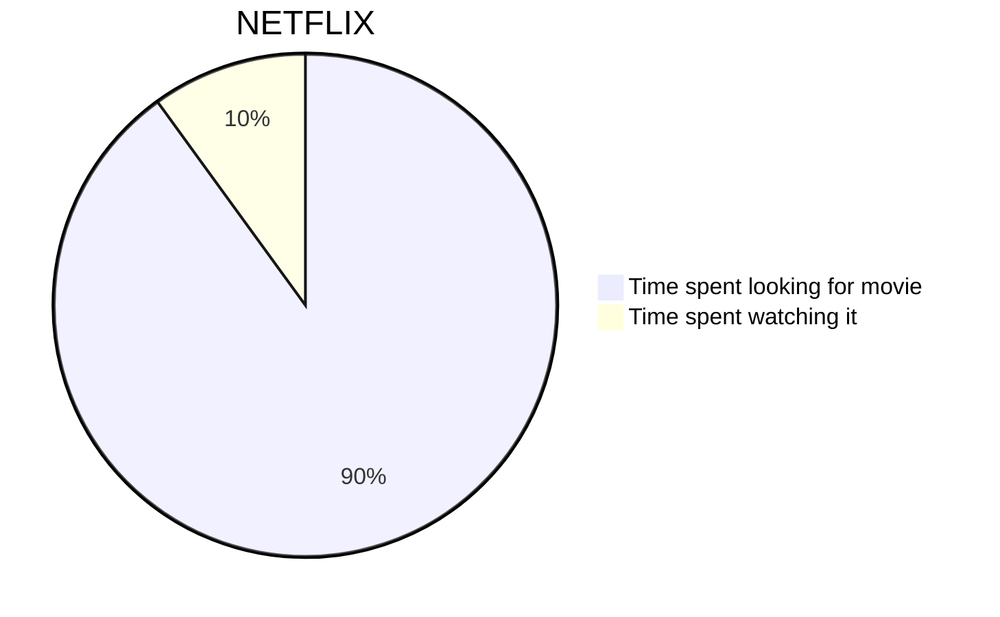

# Tests, can be ignored

How to use:
Preferably only use in `mkdocs serve`.


## Callouts
> [!info] Test
> This is a test callout

```md
> [!info] Test
> This is a test callout
```

Follows the obsidian style: [callouts](https://help.obsidian.md/callouts)


## Mermaidjs

Mermaidjs is a library that allows you to make some graphics. It is integrated by default inside Obsidian, and I made MkDocs use it.

Some example diagrams include:


Inside a mermaidjs code block:
```md
stateDiagram-v2
  [*] --> Still
  Still --> Moving
  Moving --> Crash
  Crash --> [*]
```


```md
pie title NETFLIX
  "Time spent looking for movie" : 90
  "Time spent watching it" : 10
```

Follows the documentation on [their website](https://mermaid.js.org/intro/)

## MathJax
MathJax is another markup language, which is a light and non-compiled version of another language called LaTeX. While LaTeX is a powerful tool to write documents and pages, this isn't the goal here, where we use MathJax essentially just to write math stuff, such as the following:

$$
\cos x=\sum_{k=0}^{\infty}\frac{(-1)^k}{(2k)!}x^{2k}
$$

```md
$$
\cos x=\sum_{k=0}^{\infty}\frac{(-1)^k}{(2k)!}x^{2k}
$$
```

> [!warning]+ Beware!
> While in obsidian it's optional, for the MkDocs you'll need an extra line before and after the 2 dollar signs.

You can also write inline MathJax, such as $a^2+b^2=c^2$ using a single dollar sign.

## canvasjs

I was particularly bored and clairvoyant a sunday evening during summer vacation, so I added support for canvasjs in both Obsidian and MkDocs. Given I wrote it from basically scratch, at 1 in the morning, it's quite janky, but it usually works. If it doesn't, send me a message and I might do something about it.

Most of the documentation can be found on their [website](https://canvasjs.com/docs/charts/intro/)

To make a simple chart, you just need to add the same data that the doc would require of you after the 'chartContainer' string, in the same format, inside a canvasjs codeblock. For it to work well in Obsidian, you'll also probably want to customize / add a custom height parameter, that'll define the height in Obsidian. 

```canvasjs
{
  "height": 500,
  "title": {
    "text": "Custom Legend Chart"
  },
  "legend": {
    "itemclick": "toggleDataSeries"
  },
  "data": [
    {
      "type": "column",
      "name": "Apples",
      "showInLegend": true,
      "dataPoints": [
        { "label": "Jan", "y": 10 },
        { "label": "Feb", "y": 15 },
        { "label": "Mar", "y": 25 }
      ]
    },
    {
      "type": "column",
      "name": "Oranges",
      "showInLegend": true,
      "dataPoints": [
        { "label": "Jan", "y": 20 },
        { "label": "Feb", "y": 10 },
        { "label": "Mar", "y": 15 }
      ]
    }
  ]
}
```


```json
{
  "height": 500,
  "title": {
    "text": "Custom Legend Chart"
  },
  "legend": {
    "itemclick": "toggleDataSeries"
  },
  "data": [
    {
      "type": "column",
      "name": "Apples",
      "showInLegend": true,
      "dataPoints": [
        { "label": "Jan", "y": 10 },
        { "label": "Feb", "y": 15 },
        { "label": "Mar", "y": 25 }
      ]
    },
    {
      "type": "column",
      "name": "Oranges",
      "showInLegend": true,
      "dataPoints": [
        { "label": "Jan", "y": 20 },
        { "label": "Feb", "y": 10 },
        { "label": "Mar", "y": 15 }
      ]
    }
  ]
}
```

> [!warning]+ Beware!
> This won't work in other obsidian vaults, as plugins are per vault. If you want it desperately, you can copy the plugin file. You'll figure it out, I believe in you. Or just send me a message.
